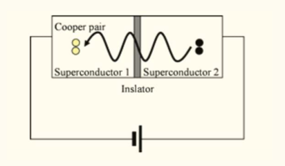
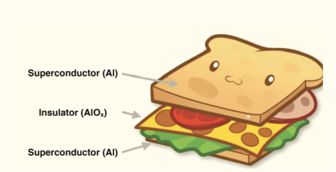
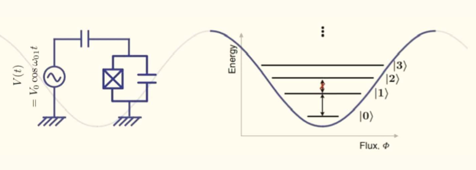

# **ARTIFICIAL ATOMIC CIRCUITS**

## **Introduction**

Hello everyonel! We are back with exciting facts about circuits made up of artificial atoms. It is known that atoms are the building blocks of quantum computing. However, atoms are tiny to work with. Moreover, they are very fragile and complex, so one must look for an alternative to replace them. It is hard to mimic the properties of natural atoms with ease, but through indepth research and hard work, scientists have started to crack the code. Many ways have been deduced to tackle such problems, which lead to the realization of artificial atoms. Various concepts like oscillators, superconductivity, electrodynamics etc., have been employed to make an artificial atom or a circuit capable of mimicking the properties of an atom. We will take you on a journey through those concepts of physics.

## **Physics of Artificial Atoms**

In one of the previous articles, we discussed how a quantum bit or qubit has two bits in superposition, namely |0> and |1> bits. These could also be referred to as the 'ground' state and the 'excited' state. In any real/natural atom, these states have fixed energy associated with them. When they move between the ground and the excited states, an electromagnetic wave of a particular frequency is either emitted or absorbed depending on the transition direction. The associated energy of the wave equals the energy difference between the ground and excited states. Atoms are the entities of the microscopic domain. On the other hand, in the macroscopic world, an Inductor-Capacitor circuit (or an LC circuit) displays a similar phenomenon of transitions between the distinct energy states and further could exist in a superposition with those states. The oscillation of electric dipoles with periodic changes in electric and magnetic fields leads to electromagnetic waves of a particular frequency. However, there is one major difference. In an atom, the difference between the energy of two consecutive orbits decreases as we move to higher energy levels. In contrast, the energy gap throughout all the statesis constant in LC circuits. The varying energy gaps are vital for uniquely identifying two states of particular energy separation in an atom to qubits with no information leakage to other states. Therefore, to accurately mimic an atom, we must induce non-uniformity in the energy gaps between the states, i.e., 'non-linearity' in an LC oscillator. To perform this task, one could replace the inductor in the LC circuit with the Josephson Junction that acts as an inductor. Josephson Junctions are made up of sandwiching a thin layer of insulators between two superconductors. The superconductivity is exhibited with the transition of paired electrons called Cooper pairs from one semiconductor to another via an insulator. The superconductivity occurs at much lower temperatures, about -273°C, reducing errors due to heat. Having created an 'Artificial' atom based on superconductivity, one could proceed to turn it into a qubit known as Transmon that could be further used to undertake Quantum Computing. The circuit-like structure of Transmon allows it to integrate with other qubits to create a multi-qubit quantum computer. Artificial atoms could also be realized by various other means. For example, using particles of a semiconductor that have a diameter of about a few nanometers.

## **Superconductivity**

Superconductivity is exhibited when there is no resistance offered in the path of electricity, which indeed happens at absolute zero temperature. Moreover, as no resistance is offered, it guarantees no loss in the signal's power along the path.

In the case of atomic circuits, each change in data, however small, is vital to consider, as these minor disturbances in data can affect further calculations and make the data out of context.

In fact, instead of the expected repelling forces among negatively charged electrons that repel each other, an effective, attractivé force between the electrons assists in conducting the electricity. This is due to the Coulomb repulsion being weakened by the many conducting electrons as they shield each other. At the same nite the lattice vibrations arb andestalemare of the conditions, the attraction wins. The attractive interaction between the electrons makes them bond together in pairs to form Cooper pairs.

The Cooper pairs behave differently from the original electrons described by the laws of Quantum Physics. While the electrons bump into the crystal lattice, the Cooper pairs do not scatter into individual electrons as the two electrons of the Cooper pair are not spatially close to each other. Instead, they scatter as a pair on encounter with a given defect or lattice vibration of the crystal. Quantum Physics infers that minimum energy needs to be spent in breaking a Cooper pair. As long as this energy is not available, they cannot scatter. Further, Cooper pairs of electrons do not experience any energy loss while still transferring charge from point to point, thus leading to zero electrical resistance.

The hike in the temperature of the crystal is one of the means to supply random energy in the degrees of freedom of a system, which assists in overcoming the energy of the Cooper pair bond, also called the superconducting gap. The electrical resistance will come back whenever the Cooper pair breaks to give their constituent electrons. Hence, there exists threshold temperature superconductivity for any given superconducting material.

## **Superconducting Qubit**

So far, we have read about the physics behind artificial atoms and superconductivity. Let's look at how these principles of superconductivity and LC circuit oscillations could be used to form qubits essential for quantum computing.

Let's recall that the ground state of an atom is being referred to as 0 ket (denoted as |0>) while the first excited state is 1 ket (denoted as |1>). The change of electron's state within an atom is achieved by the supply of suitable external energy, which is possible with an excitation, i.e., by providing energy E=hv. Deexcitation also leads to change in state by releasing energy.

This transition of electrons from one energy state to another is accompanied by absorption or dissipation of energy.

It is possible to have a superposition of ground and excited states by inducing oscillations of electrons between the atomic states, called Rabi Oscillations. On the other hand. superconductivity is a quantum phenomenon and can only occur exploited to new also calliente guantumperalehducaleStates. Further, the system could undergo transitions, leading to superposition states like qubits realized from the natural atom's oscillation between ground and excited states. It is possible to have a superposition of ground and excited states by inducing oscillations of electrons between the atomic states, called Rabi Oscillations. On the other hand. superconductivity is a quantum phenomenon and can only occur at minute length (also called the quantum scale). It could be exploited to have a coexistence of two superconducting states. Further, the system could undergo transitions, leading to superposition states like qubits realized from the natural atom's oscillation between ground and excited states.

In classical physics, we encounter various oscillations, i.e., damped, periodic or harmonic etc. The real-life scenario of small oscillations is encountered through harmonic oscillations, wherein a particle oscillating performs a to and fro motion from one extreme energy point to another in a sinusoidal manner. This kind of oscillation is even observed in an electronic circuit's charges. In high-school physics, we have learned how oscillations of charge are formed through an LC-circuit. The charge passing through the inductor(L) and capacitor(C) performs a harmonic oscillation. Charge on capacitor is given by: Q(t) = Q(0) cos(wt), where w =1/Square-root(LC) is the angular frequency and Q(0) is the maximum charge accumulated on the capacitor. The total energy of such a system is equal to the sum of the potential energy and the kinetic energy of an equivalent spring-mass system.

Here.

the potential energy (PE) =1/2 kx²

where k=mw is equivalent to the spring constant of a spring-mass system, and the 

kinetic energy(KE) = 1/2m p²

where 'p' is the momentum of oscillating charge. Hence, the 

total energy (E) = P.E + K.E = 1/2 kx² + 1/2m p²

Similarly, in quantum physics, the energy of an atomic system is defined as the Hamiltonian operator (H), which is expressed by replacing momentum and position variables with their counterparts in the form of operator

^H= 1/2 k ^x² + 1/2m ^p²

Using the above Hamiltonian formalism, one can show similarities between the harmonic oscillation among quantum states and the LC oscillations, wherein the oscillations occur among the various charge and discharge states of the capacitor contained in the LC circuit. Therefore, the circuit could mimic the Rabi oscillations as shown below in the diagram.

As one can see, the possible Rabi oscillations among the various energy states realized using the LC circuit could be controlled by some external voltage V(t) obtained from a microwave source. However, as equal energy separation exists among the LC circuit states, this LC circuit-based superposition cannot be contained between any specific pair states.

Even the room temperature is enough to drive the system out of the specific superposition as room temperature can supply thermal energy more than the energy gaps of the states. The problem that arises is that it does notreplicate an actual atom. Instead, it gives us the superposition of replicated energy levels, i.e., the superposition of |0>, |1>, |2>, and so on. Hence the Hilbert space is not the same as that of the atom, thus leaving in the leakage of qubits.

To overcome this problem, one could resort to a solution in the form of Josephson junction invented by a British theoretical Physicist by the name Brian David Josephson during his doctoral studies. Josephson junction is constructed by sandwiching a thin layer of insulators between two superconductors, and this novel idea led to the Nobel prize in 1973.

In an LC circuit, we know that the inductor(L) involves a linear relation between magnetic flux (Φ) and the current as I = Φ/L. The total energy in terms of the Hamiltonian operator (^H) of the LC circuit would be the sum of energy stored in the capacitor and the inductor in the form of charge accumulation and magnetic field, respectively:

^H=1/2C^V² + 1/2L^I²

The terms are similar to classical harmonic oscillator's potential and kinetic energies. Various possible energy states of the system would be represented by the ladder steps that exist within the parabolic potential dictated by the second term, similar to the potential energy of the classical oscillator. As long as the current is a linear function of flux, the possible energy states are placed equally in the parabolic potential. This is the reason for the same level of harmonic oscillation, which results in equal spacing between he resulting nergy levels. On the ther hand, the Joephson junction, which acts as an inductor, gives the current and flux relationship in a non-linear manner, as shown below.

The inclusion of Josephson Junction alters the nature of potential energy from a simple parabolic to a cosine function in magnetic flux (Φ). Once the potential curve gets converted into a cosine function, all the equally spaced energy levels extended to infinity earlier get squeezed to a much smaller vertical domain, leading to the unequal spacing between the energy levels, replicating atomic levels to form an artificial atom which is shown below in the diagram.

Finally, we have arrived at a circuit that replicates an atom and is being used as a qubit. led to the development of a 'Transmon' Further advancements in the jiG circuit "with losephsc junction superconducting charge qubit designed to have reduced sensitivity to charge noise. The Transmon was developed by Robert J. Schoelkopf, Michel Devoret, Steven M. Girvin and their colleagues at Yale University in 2007. Its name is an abbreviation of the term, **transmission line shunted plasma oscillation qubit**; one consists of a Cooper-pair box 'where the two superconductors are also capacitively shunted to decrease the sensitivity to charge noise while maintaining a sufficient anharmonicity for selective qubit control'.

## **Superconducting transmon qubits**

The Transmon achieves its reduced sensitivity to charge noise by significantly increasing the ratio of the Josephson energy to the charging energy. This is accomplished by using a large shunting capacitor with more surface area of the capacitor plates merged two comb structures. The result is energy level Placings that are approximately independent of offset charge Planar on-chip transmon qubits have T1 coherence times ~ 30us to 40 us. By replacing the superconducting transmission line cavity with a three-dimensional superconducting cavity, recent work on transmon qubits has shown significant improvement T1 times, as long as 95us.

These results demonstrate that Josephson junction losses did not limit previous T1 times. Understanding the fundamental limits on the coherence time in superconducting qubits such as the Transmon is an active area of research.

## **Circuit QED**

We have seen how a qubit can be formed with the help of a Josephson junction, a capacitor and a controlled voltage source. Let's look out for the circuit combination that can be formed, which will lay a foundation for the qubit architecture.

Like classical computing using transistors (MOSFETS circuits), this Josephans junction and a capacitor forming a non-linear LC circuit could be analogized as a transistor on quantum computers.

In classical computers, the transistors are either being operated through current or voltage (in the case of MOSFET). Here the single qubit is manipulated/operated through microwaves (an electromagnetic wave). These waves are the set of inputs given to the Transmon. This set of input is circulated throughout the artificial atoms in the cavity. The cavity acts as a quantum bus, which helps communicate between qubits and form multi-qubit architecture. The flow of signals is manipulated through different frequencies, and the use of different capacitors helps activate qubit information at that instant.

The diagram below is the realization of a single qubit in 1D.

Here, one can see the cavity through which the microwave could travel and interact with the Transmon to give a particular output as required. Now for various qubits to interact with each other, one can scale up this qubit structure and form a multi-qubit structure by linking cavities of various transmons (i.e., Quantum Bus) as shown below:

As shown in the above figure, we can also realize the transmon circuit multi-qubit architecture in a classical manner.

                                                                                        ~Quantum Computing Club
                                                                                                  IIIT Dharward
